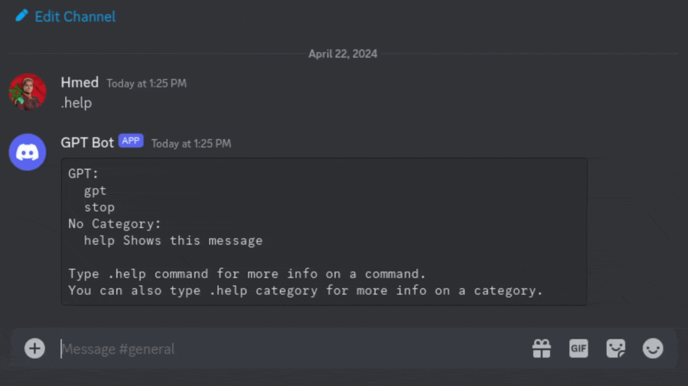

# Discord-GPT-Bot
Simple discord bot that utilizes a local model checkpoint to generate responses.

## Commands:

1) `.gpt prompt`
   - Description: Generates a response from the AI model based on the provided prompt.
   - Optional: Include `-tts` to enable text-to-speech functionality.

2) `.stop`
   - Description: Stops the current generation process initiated by the `.gpt` command.

## Preview:

## License

This project is licensed under the [MIT License](LICENSE).
